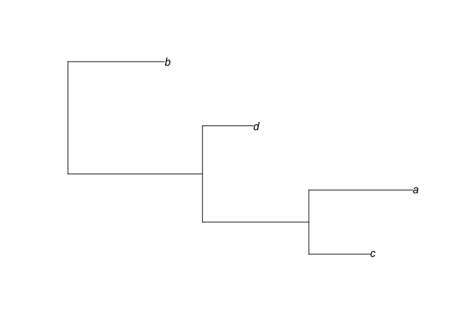
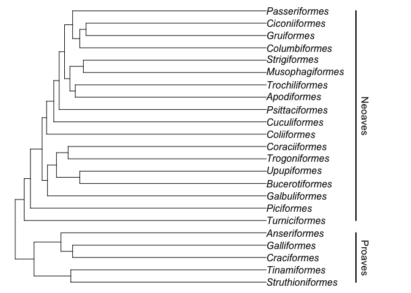
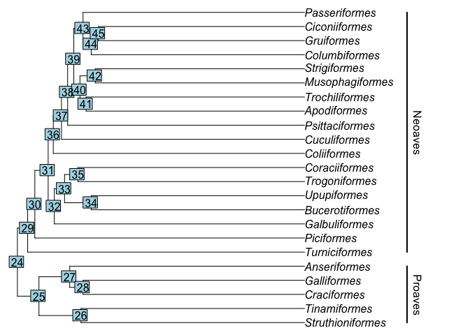
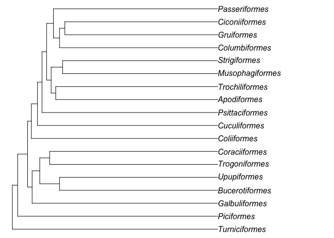
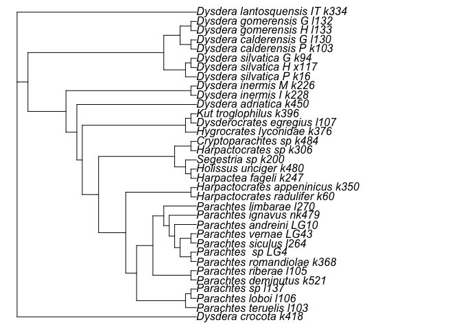
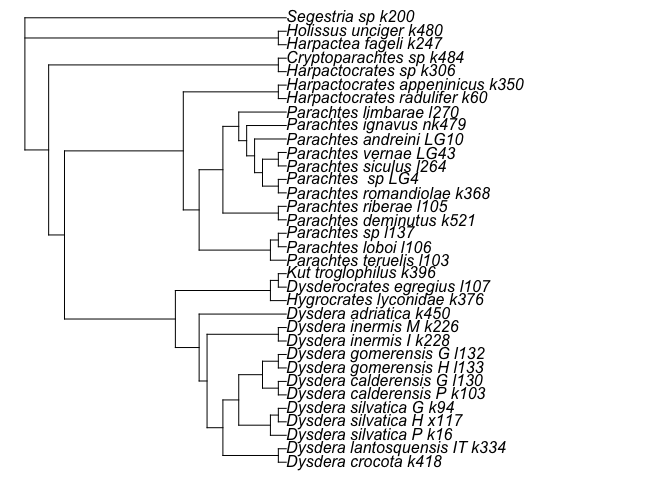
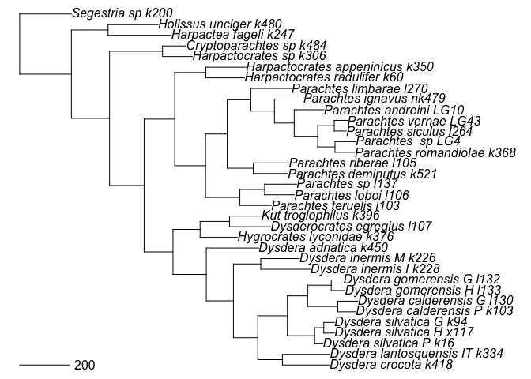
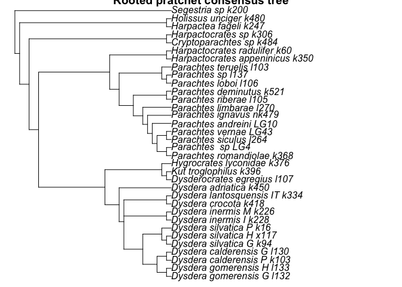
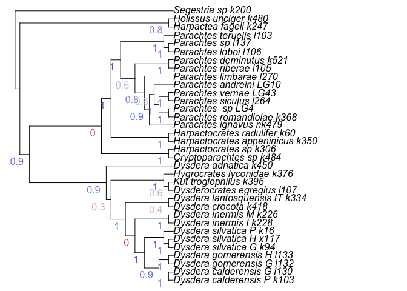

### Credits
This exercise is based on the R tutorial for course [BIOS1140](https://bios1140.github.io/) at the University of Oslo aand examples provided in the github of [`phangorn`](https://github.com/KlausVigo/phangorn/blob/master/vignettes/Morphological.Rmd) by Klaus Schliep


### What to expect
In this tutorial, we will introduce phylogenetics as a means to visualise the evolutionary relationships among species and will conduct our first phylogenetic analyses using parsimony as method of inference
In this section we will:

-   learn some tools for visualizing phylogenetic trees
-   learn how to create phylogenies

### Getting started

First, we need to set up our R environment. We'll load `tidyverse` a package that facilitates dta manipulation and visualization. along a few more packages today to help us handle different types of data. Chief among these is `ape` which is the basis for a lot of phylogenetic analysis in R. 
We will also load another phylogenetic package, `phangorn` (which has an extremely [geeky reference](https://en.wikipedia.org/wiki/Fangorn) in its name).


``` r
# clear the R environment
rm(list = ls())

# install new packages
install.packages("ape")
install.packages("phangorn")
install.packages("ips")
install.packages("TreeSearch")
install.packages("tidyverse")

# load packages
library(ape)
library(phangorn)
library(ips)
library(TreeSearch)
library(tidyverse)
```

With these packages installed, we are ready to begin!

## Phylogenetics in R


R has a number of extremely powerful packages for performing phylogenetic analysis, from plotting trees to testing comparative models of evolution. You can see [here](https://cran.r-project.org/web/views/Phylogenetics.html) for more information if you are interested in learning about what sort of things are possible. For today's session, we will learn how to handle and visualize phylogenetic trees in R. We will also construct a series of trees from a sequence alignment. First, let's familiarize ourselves with how R handles phylogenetic data.

### Storing trees in R

The backbone of most phylogenetic analysis in R comes from the functions that are part of the `ape` package. `ape` stores trees as `phylo` objects, which are easy to access and manipulate. The easiest way to understand this is to have a look at a simple phylogeny, so we'll create a random tree now.


``` r
# set seed to ensure the same tree is produced
set.seed(32)
# generate a tree
tree <- rtree(n = 4, tip.label = c("a", "b", "c", "d"))
```

What have we done here? First, the `set.seed` function just sets a seed for our random simulation of a tree. You won't need to worry about this for the majority of the time, here we are using it to make sure that when we randomly create a tree, we all create the same one.

What you need to focus on is the second line of code that uses the `rtree` function. This is simply a means to generate a random tree. With the `n = 4` argument, we are simply stating our tree will have four taxa and we are already specifying what they should be called with the `tip.label` argument.

Let's take a closer look at our `tree` object. It is a `phylo` object - you can demonstrate this to yourself with `class(tree)`.


``` r
tree
#> 
#> Phylogenetic tree with 4 tips and 3 internal nodes.
#> 
#> Tip labels:
#>   c, a, d, b
#> 
#> Rooted; includes branch length(s).
```

By printing `tree` to the console, we see it is a tree with 4 tips and 3 internal nodes, a set of tip labels. We also see it is rooted and that the branch lengths are stored in this object too.

You can actually look more deeply into the data stored within the `tree` object if you want to. Try the following code and see what is inside.


``` r
str(tree)
objects(tree)
tree$edge
tree$edge.length
```

It is of course, much easier to understand a tree when we visualise it. Luckily this is easy in R.


``` r
plot(tree)
```

<!-- -->

In the next section, we will learn more about how to plot trees.

### Plotting trees

We can do a lot with our trees in R using a few simple plot commands. We will use some of these later in the tutorial and assignment, so here's a quick introduction of some of the options you have. 

First, let's generate another random tree, this time with 5 taxa.


``` r
# set seed to ensure the same tree is produced
set.seed(32)
# generate a tree
tree <- rtree(n = 5, tip.label = c("a", "b", "c", "d", "e"))
```

Now, try modifying the appearance of the tree using some of these arguments to `plot()`:

* `use.edge.length` (`TRUE` (default) or `FALSE`): should branch length be used to represent evolutionary distance?
* `type`: the type of tree to plot. Options include "phylogram" (default), "cladogram", "unrooted" and "fan".
* `edge.width`: sets the thickness of the branches
* `edge.color`: sets the color of the branches

See `?plot.phylo` for a comprehensive list of arguments.

You can also manipulate the contents of your tree:  

* `drop.tip()` removes a tip from the tree
* `rotate()` switches places of two tips in the visualisation of the tree (without altering the evolutionary relationship among taxa) 
* `extract.clade()` subsets the tree to a given clade

See the help pages for the functions to find out more about how they work. Now, let's use some of the options we've learned here for looking at some real data.

### A simple example with real data - avian phylogenetics

So far, we have only looked at randomly generated trees. Let's have a look at some data stored within `ape`---a phylogeny of birds at the order level.


``` r
# get bird order data
data("bird.orders")
```

Let's plot the phylogeny to have a look at it. We will also add some annotation to make sense of the phylogeny.


``` r
# no.margin = TRUE gives prettier plots
plot(bird.orders, no.margin = TRUE)
segments(38, 1, 38, 5, lwd = 2)
text(39, 3, "Proaves", srt = 270)
segments(38, 6, 38, 23, lwd = 2)
text(39, 14.5, "Neoaves", srt = 270)
```

<!-- -->

Here, the `segments` and `text` functions specify the bars and names of the two major groups in our avian phylogeny. We are just using them for display purposes here, but if you'd like to know more about them, you can look at the R help with `?segments` and `?text` commands.

Let's focus on the Neoaves clade for now. Perhaps we want to test whether certain families within Neoaves form a monophyletic group? We can do this with the `is.monophyletic` function.


``` r
# Parrots and Passerines?
is.monophyletic(bird.orders, c("Passeriformes", "Psittaciformes"))
#> [1] FALSE
# hummingbirds and swifts?
is.monophyletic(bird.orders, c("Trochiliformes", "Apodiformes"))
#> [1] TRUE
```

If we want to look at just the Neoaves, we can subset our tree using `extract.clade()`. We need to supply a node from our tree to `extract.clade`, so let's find the correct node first. The nodes in the tree can be found by running the `nodelabels()` function after using `plot()`:


``` r
plot(bird.orders, no.margin = TRUE)
segments(38, 1, 38, 5, lwd = 2)
text(39, 3, "Proaves", srt = 270)
segments(38, 6, 38, 23, lwd = 2)
text(39, 14.5, "Neoaves", srt = 270)
nodelabels()
```

<!-- -->

We can see that the Neoaves start at node 29, so let's extract that one.


``` r
# extract clade
neoaves <- extract.clade(bird.orders, 29)
# plot
plot(neoaves, no.margin = TRUE)
```

<!-- -->

The functions provided by `ape` make it quite easy to handle phylogenies in R, feel free to experiment further to find out what you can do!


# Inferring trees with R using parsimony

So far, we have only looked at examples of trees that are already constructed in some way. However, if you are working with your own data, this is not the case - you need to actually make the tree yourself. Luckily, `phangorn` is ideally suited for this. We will use some data, bundled with the package, for the next steps. In this example, we will investigate the phylogenetic relationships of *Parachtes* a genus belonging to the spider family Dysderidae by using a concatenated matrix of 6 mtDNA genes, namely cox1, nad1, 16S and 12S and 3 nuclear genes, 18S, 28S and Histone3, obtained from Genbank. The following code loads the data:


``` r
# get parachtes data
parachtes <- read.phyDat("ParALL153.fas", format = "fasta")
```

## Tree search
There are three different search strategies:
1. Exhaustive search (sometimes also referred as implicit enumeration, e.g. in TNT): It does guarantee the shortest tree, but there is usually a taxa limit, depending on the program used (~15). In the case of `phagorn` the usage would be `bab(data, tree = NULL, trace = 0, ...)'
2. Heuristic search: does not guarantee finding the shortest tree. It usually consists on two rounds, first you build a tree (you can use different strategies, e.g. random addition of taxa, Wagner tree,..), followed by branch swapping, which algorithms that exchnge bracnhes of the starting tree looking for shorter trees (from lighter to thorougher rearrangements: NNi, SPR, TBR). In `phangorn`, you can use `random.addition` to compute a starting trees. The function `optim.parsimony` performs tree rearrangements to find trees with a lower parsimony score. The tree rearrangements implemented are nearest-neighbor interchanges (NNI) and subtree pruning and regrafting (SPR). The latter so far only works with the fitch algorithm. We iterate this procedures many timoes (e.g.>100) 
3. New search strategies: these are optimised algorithm for heuristic searchers of large data matrices (e.g. >100 taxa). There are several strategies here. In this practical, we will implement parsimony ratchet. The function is `pratchet`, an implementation of the parsimony ratchet (Nixon 1999). This allows to escape local optima and find better trees than only performing NNI / SPR rearrangements.

The current implementation is

1. Create a bootstrap data set 𝐷𝑏from the original data set.
2. Take the current best tree and perform tree rearrangements on 𝐷𝑏and save bootstrap tree as 𝑇𝑏.
3. Use 𝑇𝑏and perform tree rearrangements on the original data set. If this tree has a lower parsimony score than the currently best tree, replace it.
4. Iterate 1:3 until either a given number of iteration is reached (minit) or no improvements have been recorded for a number of iterations (k).


``` r
# search for the most parsimonious (MP) tree
treeRatchet  <- pratchet(parachtes, start = NULL, method = "fitch",  minit = 100, k = 10, trace = 1, all = TRUE, rearrangements = "SPR", perturbation = "ratchet")
#> Parsimony score of initial tree: 7893 
#> 
Iteration: 10. Best parsimony score so far: 7893
Iteration: 20. Best parsimony score so far: 7893
Iteration: 30. Best parsimony score so far: 7893
Iteration: 40. Best parsimony score so far: 7893
Iteration: 50. Best parsimony score so far: 7893
Iteration: 60. Best parsimony score so far: 7893
Iteration: 70. Best parsimony score so far: 7893
Iteration: 80. Best parsimony score so far: 7893
Iteration: 90. Best parsimony score so far: 7893
Iteration: 100. Best parsimony score so far: 7893
#to report the number of steps
parsimony(treeRatchet, parachtes)
#> [1] 7893
```
Now that we have inferred the MP tree, we should plot it to have a look. 


``` r
# plot MP tree
plot(treeRatchet,no.margin = TRUE)
```

<!-- -->

### Tree rooting

Notice that so far we have not define which species is the outgroup for the analysis. By default the first taxon in the matrix is assigned as outgroup. Also, notice that even if show the tree as rooted, the analyses infer trees that are unrooted. We can verify that the tree is unrooted using the `is.rooted()` function.


``` r
# check whether the tree is rooted
is.rooted(treeRatchet)
```

We can also set a root on our tree, if we know what we should set the outgroup to. In our case, we can set our outgroup to Segestria_sp_k200.

We will set the root of our tree  using the `root` function and we'll then plot it to see how it looks.


``` r
# plot treeRatchet rooted
treeRatchet_r <- root(treeRatchet, "Segestria_sp_k200", resolve.root = TRUE, edgelabel = TRUE)
plot(treeRatchet_r, no.margin = TRUE)
```

<!-- -->

Notice that the tree remains the same, you can move the root to any other node, and the tree is fully equivalent. You can check that by asking again about the length of the tree with the new root.


``` r
# reporting tree length (steps)
parsimony(treeRatchet_r, parachtes)
#> [1] 7893
```

### Branch lengths

Also, observe that this is tree  only inform about the topology. If we wanted to also include the number of substitution in each branch (i.e. branch length), we have to do the following:


``` r
# perform character optimization
treeRatchet_r<-acctran(treeRatchet_r, parachtes)
```

This funciton assaigns edge weights. We now plot the tree with the corresponding branch length information:


``` r
# plot the rooted tree with branch lengths
plot(treeRatchet_r, type="phylogram", no.margin = TRUE)
add.scale.bar()
```

<!-- -->

### Exporting a tree

Now that we have our tree properly rooted and with branch lengths, we can easily write it to a file in `Newick` format:

``` r
# rooted tree with branch lengths
write.tree(treeRatchet_r, "parachtes.tre")
```

### Consensus tree

Let's generate a new tree use random addition of taaxa, and a second one optimizing the first one with SPR swapper:


``` r
# heuristic search using random addiiton of taxa
treeRA <- random.addition(parachtes)
treeSPR  <- optim.parsimony(treeRA, parachtes)
#> Final p-score 7893 after  1 nni operations
```

Let's compare the legth of the two former trees


``` r
# compare the length of the trees
parsimony(c(treeRA, treeSPR), parachtes)
#> [1] 7894 7893
```

To find out what are the topological differences of the two trees, we can look at the consensus from treeRA and treeSPR, using the command `consensus` function from `ape`.


``` r
#combines both trees into a single object
obj<-c(treeRA, treeSPR)
# Calculate and plot the consensus tree
obj_cons <- root(consensus(obj), outgroup = "Segestria_sp_k200",resolve.root = TRUE, edgelabel =TRUE)
plot(obj_cons, main="Rooted pratchet consensus tree",no.margin = TRUE)
```

<!-- -->

We can  see that the source of conflict lays within the Dysdera genus


## Gaps

So far we have conducted all parsimony analyses assuming gap are missing data, which is the default option. However, we may want to investigate if our inferences would change if gaps were scored as an additional character state. We can do this by using the following commands:


``` r
#indicate gaps defined as "-" are a new state and that "n" and "?" should be considered missing data
parachtes_5<-gap_as_state(parachtes, gap = "-", ambiguous = c("n","?"))
```

Similarly, we can decide to score gaps as an alternative absence/presence character, following the simple coding method proposed by Simmons & Ochoterena. 2000. We will. use the `ìps`package command `code.simple.gaps`. Note that the gapped positions are excluded from the matrix.


``` r
#First, we will transform our parachtes matrix from a phyDat class object to a DNAbin class object
parachtes_DNAbin<-as.DNAbin(parachtes)
#Now we car recode the gaps as absence/presence data
parachtes_DNAbin_ap<-code.simple.gaps(parachtes_DNAbin)
#> $Gap_1
#> [1] 1952
#> 
#> $Gap_2
#> [1] 1984
#> 
#> $Gap_3
#> [1] 2532
#> 
#> $Gap_4
#> [1] 2670
#> 
#> $Gap_5
#> [1] 2800 2801
#> 
#> $Gap_6
#> [1] 2929
#> 
#> $Gap_7
#> [1] 2935
#> 
#> $Gap_8
#> [1] 3029
#> 
#> $Gap_9
#> [1] 3642 3643
#> 
#> $Gap_10
#> [1] 3675
#> 
#> $Gap_11
#> [1] 3691
#> 
#> $Gap_12
#> [1] 3709 3710
#> 
#> $Gap_13
#> [1] 3715
#> 
#> $Gap_14
#> [1] 3728
#> 
#> $Gap_15
#> [1] 3737 3738
#> 
#> $Gap_16
#> [1] 3767 3768 3769
#> 
#> $Gap_17
#> [1] 3798
#> 
#> $Gap_18
#> [1] 3840
#> 
#> $Gap_19
#> [1] 3862
#> 
#> $Gap_20
#> [1] 3923
#> 
#> $Gap_21
#> [1] 3965
#> 
#> $Gap_22
#> [1] 3987
#> 
#> $Gap_23
#> [1] 4024 4025
#> 
#> $Gap_24
#> [1] 4027
#> 
#> $Gap_25
#> [1] 4182
#> 
#> $Gap_26
#> [1] 4187
#> 
#> $Gap_27
#> [1] 4191
#> 
#> $Gap_28
#> [1] 4194 4195
#> 
#> $Gap_29
#> [1] 4234
#> 
#> $Gap_30
#> [1] 4260
#> 
#> $Gap_31
#> [1] 4288 4289
#> 
#> $Gap_32
#> [1] 4298
#> 
#> $Gap_33
#> [1] 4304
#Finally, we will transform the new matrix with the recoded gaps back into a phyDat object
parachtes_ap<-as.phyDat(parachtes_DNAbin_ap)
```


## Node support

Inference methods like Parsimony and Maximum Likelihood produce one or more best trees that meet certain optimality criteria, such as being the shortest tree or best explaining the data given a specific evolutionary model. However, we may need to assess the impact of character undersampling (random error) on our results. Specifically, we want to determine the support for the nodes recovered in the preferred tree(s). One way to do this is by using resampling techniques. These techniques involve generating pseudoreplicates (ideally >100) of our original matrix either by resampling characters with repetition (bootstrap) or by randomly removing a proportion of the original matrix (Jaccknife). For each matrix, we find the best tree(s). Finally, we determine the node support by estimating the proportion of time that each node is recovered in the resampled trees. We will estimate node support using resampling with the package `TreeSearch`.

The package includes a more intensive version of the parsimony ratchet strategy for estimating the most parsimonious tree. we will first implement this strategy using the follwoing commands:


``` r
# An heuristic search using parsimony ratchet (Nixon, 1999)
parachtes_tre <- MaximizeParsimony(parachtes, ratchIter = 100, startIter = 2,
                           tbrIter = 2, maxHits = 4, maxTime = 1/100, verbosity = 4)
parachtes_tre_r <- root(parachtes_tre, "Segestria_sp_k200", resolve.root = TRUE, edgelabel = TRUE)
firstHit <- attr(parachtes_tre, "firstHit")
firstHit
#>     seed    start   ratch1   ratch2   ratch3   ratch4   ratch5   ratch6 
#>        0        2        0        0        0        0        0        0 
#>   ratch7   ratch8   ratch9  ratch10  ratch11  ratch12  ratch13  ratch14 
#>        0        0        0        0        0        0        0        0 
#>  ratch15  ratch16  ratch17  ratch18  ratch19  ratch20  ratch21  ratch22 
#>        0        0        0        0        0        0        0        0 
#>  ratch23  ratch24  ratch25  ratch26  ratch27  ratch28  ratch29  ratch30 
#>        0        0        0        0        0        0        0        0 
#>  ratch31  ratch32  ratch33  ratch34  ratch35  ratch36  ratch37  ratch38 
#>        0        0        0        0        0        0        0        0 
#>  ratch39  ratch40  ratch41  ratch42  ratch43  ratch44  ratch45  ratch46 
#>        0        0        0        0        0        0        0        0 
#>  ratch47  ratch48  ratch49  ratch50  ratch51  ratch52  ratch53  ratch54 
#>        0        0        0        0        0        0        0        0 
#>  ratch55  ratch56  ratch57  ratch58  ratch59  ratch60  ratch61  ratch62 
#>        0        0        0        0        0        0        0        0 
#>  ratch63  ratch64  ratch65  ratch66  ratch67  ratch68  ratch69  ratch70 
#>        0        0        0        0        0        0        0        0 
#>  ratch71  ratch72  ratch73  ratch74  ratch75  ratch76  ratch77  ratch78 
#>        0        0        0        0        0        0        0        0 
#>  ratch79  ratch80  ratch81  ratch82  ratch83  ratch84  ratch85  ratch86 
#>        0        0        0        0        0        0        0        0 
#>  ratch87  ratch88  ratch89  ratch90  ratch91  ratch92  ratch93  ratch94 
#>        0        0        0        0        0        0        0        0 
#>  ratch95  ratch96  ratch97  ratch98  ratch99 ratch100    final 
#>        0        0        0        0        0        0        0
```

### Node support based on Jaccknife resampling

We will now estimate the node support using Jackknife. This is similar to Bootstrap, the most widely resampling method  for finding node support. It just differs by the type of resampling implemented, removal instead of resampling with repetition. If you want to use bootstrap instead, just replace `method = "jack"` by `method = "bootstrap"`.


``` r
# Jackknife resampling, we will build 10 resampled matrices (pseudoreplicates) only due to time constraints. Ideally >100.
nReplicates <- 10
jackTrees <- replicate(nReplicates,
  #c() ensures that each replicate returns a list of trees
  c(Resample(parachtes, method = "jack", proportion = 2 / 3, ratchIter = 2, tbrIter = 2, startIter = 1,
             maxHits = 5, maxTime = 1 / 10, verbosity = 0))
 )
```

Now we must decide what to do with the multiple optimal trees from each replicate. Alternatives are:

1. Treat each tree equally

`JackLabels(ape::consensus(trees), unlist(jackTrees, recursive = FALSE))`

2. Take the strict consensus of all trees for each replicate

`JackLabels(ape::consensus(trees), lapply(jackTrees, ape::consensus))`

3. Take a single tree from each replicate (the first; order's irrelevant)

`JackLabels(ape::consensus(trees), lapply(jackTrees, `[[`, 1))`


``` r
#Take the strict consensus of all trees for each replicate
jackTrees_consensus<-lapply(jackTrees, consensus)

#Reroot the resampled trees using the proper outgroup
jackTrees_consensus_r <- lapply(jackTrees_consensus, function(tree) {
    root(tree, "Segestria_sp_k200", resolve.root = TRUE, edgelabel = TRUE)
})

#Map the support values on the best tree

plot(parachtes_tre_r[[1]], no.margin = TRUE)
JackLabels(parachtes_tre_r[[1]], jackTrees_consensus_r,add=TRUE)
```

<!-- -->

```
#>  36  37  38  39  40  41  42  43  44  45  46  47  48  49  50  51  52  53  54  55 
#> 0.0 1.0 0.3 0.9 0.9 0.0 1.0 1.0 1.0 1.0 0.6 0.8 0.9 0.6 1.0 1.0 1.0 1.0 1.0 1.0 
#>  56  57  58  59  60  61  62  63  64  65  66 
#> 0.8 1.0 0.6 0.4 1.0 0.9 1.0 1.0 1.0 1.0 1.0
```


# Exercises

Find the most parsimonious tree, considering gaps as absence/presence. Properly root the tree and report the tree, indicating the number of steps (length). Assess the node support using Jackknife.

In the CV, use the task option to submit your answer


### Session info


```
#> R version 4.4.1 (2024-06-14)
#> Platform: aarch64-apple-darwin20
#> Running under: macOS 15.6.1
#> 
#> Matrix products: default
#> BLAS:   /Library/Frameworks/R.framework/Versions/4.4-arm64/Resources/lib/libRblas.0.dylib 
#> LAPACK: /Library/Frameworks/R.framework/Versions/4.4-arm64/Resources/lib/libRlapack.dylib;  LAPACK version 3.12.0
#> 
#> locale:
#> [1] en_US.UTF-8/en_US.UTF-8/en_US.UTF-8/C/en_US.UTF-8/en_US.UTF-8
#> 
#> time zone: Europe/Madrid
#> tzcode source: internal
#> 
#> attached base packages:
#> [1] stats     graphics  grDevices utils     datasets  methods   base     
#> 
#> other attached packages:
#>  [1] TreeSearch_1.6.0 ips_0.0.12       phangorn_2.12.1  ape_5.8-1       
#>  [5] lubridate_1.9.4  forcats_1.0.0    stringr_1.5.1    dplyr_1.1.4     
#>  [9] purrr_1.0.4      readr_2.1.5      tidyr_1.3.1      tibble_3.2.1    
#> [13] ggplot2_3.5.2    tidyverse_2.0.0 
#> 
#> loaded via a namespace (and not attached):
#>  [1] tidyselect_1.2.1    farver_2.1.2        R.utils_2.13.0     
#>  [4] bitops_1.0-9        fastmap_1.2.0       RCurl_1.98-1.17    
#>  [7] promises_1.3.2      PlotTools_0.3.1     shinyjs_2.1.0      
#> [10] XML_3.99-0.18       digest_0.6.37       timechange_0.3.0   
#> [13] mime_0.13           lifecycle_1.0.4     cluster_2.1.8.1    
#> [16] magrittr_2.0.3      compiler_4.4.1      rlang_1.1.6        
#> [19] sass_0.4.10         tools_4.4.1         TreeTools_1.14.0   
#> [22] igraph_2.1.4        yaml_2.3.10         data.table_1.17.2  
#> [25] knitr_1.50          bit_4.6.0           plyr_1.8.9         
#> [28] RColorBrewer_1.1-3  R.cache_0.17.0      withr_3.0.2        
#> [31] R.oo_1.27.1         grid_4.4.1          xtable_1.8-4       
#> [34] colorspace_2.1-1    future_1.49.0       globals_0.18.0     
#> [37] scales_1.4.0        cli_3.6.5           rmarkdown_2.29     
#> [40] generics_0.1.4      RcppParallel_5.1.10 rstudioapi_0.17.1  
#> [43] tzdb_0.5.0          cachem_1.1.0        Rogue_2.1.6        
#> [46] parallel_4.4.1      matrixStats_1.5.0   vctrs_0.6.5        
#> [49] Matrix_1.7-3        TreeDist_2.9.2      jsonlite_2.0.0     
#> [52] hms_1.1.3           bit64_4.6.0-1       listenv_0.9.1      
#> [55] protoclust_1.6.4    jquerylib_0.1.4     parallelly_1.44.0  
#> [58] glue_1.8.0          codetools_0.2-20    stringi_1.8.7      
#> [61] gtable_0.3.6        later_1.4.2         quadprog_1.5-8     
#> [64] pillar_1.10.2       htmltools_0.5.8.1   R6_2.6.1           
#> [67] zigg_0.0.2          Rdpack_2.6.4        evaluate_1.0.3     
#> [70] shiny_1.10.0        lattice_0.22-7      rbibutils_2.3      
#> [73] R.methodsS3_1.8.2   Rfast_2.1.5.1       memoise_2.0.1      
#> [76] httpuv_1.6.16       bslib_0.9.0         Rcpp_1.0.14        
#> [79] fastmatch_1.1-6     nlme_3.1-168        xfun_0.52          
#> [82] fs_1.6.6            pkgconfig_2.0.3
```
