### Credits
This exercise is based on the R tutorial for course [BIOS1140](https://bios1140.github.io/) at the University of Oslo aand examples provided in the github of [`phangorn`](https://github.com/KlausVigo/phangorn/blob/master/vignettes/Morphological.Rmd) by Klaus Schliep


### What to expect
In this tutorial, we will introduce phylogenetics as a means to visualise the evolutionary relationships among species and will conduct our first phylogenetic analyses using parsimony as method of inference
In this section we will:

-   learn some tools for visualizing phylogenetic trees
-   learn how to create phylogenies

### Getting started

First, we need to set up our R environment. We'll load `tidyverse` a package that facilitates data manipulation and visualization. along a few more packages today to help us handle different types of data. Chief among these is `ape` which is the basis for a lot of phylogenetic analysis in R. 
We will also load another phylogenetic package, `phangorn` (which has an extremely [geeky reference](https://en.wikipedia.org/wiki/Fangorn) in its name).


``` r
# Packages required for this practical
packages <- c(
  "ape",
  "phangorn",
  "ips",
  "TreeSearch",
  "tidyverse"
)

# 1. Install missing packages
installed <- rownames(installed.packages())
missing <- setdiff(packages, installed)

if (length(missing) > 0) {
  message(
    "Installing missing packages: ",
    paste(missing, collapse = ", ")
  )
  
  install.packages(
    missing,
    dependencies = TRUE
  )
}

# 2. Check the dependency required by TreeSearch
if (!requireNamespace("rbibutils", quietly = TRUE) ||
    packageVersion("rbibutils") <= "2.4") {
  
  message(
    "Updating rbibutils (required by TreeSearch)..."
  )
  
  install.packages("rbibutils")
  
  stop(
    "rbibutils has been updated. ",
    "Please restart R (Session > Restart R) ",
    "and knit the document again."
  )
}

# 3. Load required packages
library(ape)
library(phangorn)
library(ips)
library(TreeSearch)
library(tidyverse)
```

With these packages installed, we are ready to begin!

\newpage

# ---SESSION 1---

# Phylogenetics in R

R has a number of extremely powerful packages for performing phylogenetic analysis, from plotting trees to testing comparative models of evolution. You can see [here](https://cran.r-project.org/web/views/Phylogenetics.html) for more information if you are interested in learning about what sort of things are possible. For today's session, we will learn how to handle and visualize phylogenetic trees in R. We will also construct a series of trees from a sequence alignment. First, let's familiarize ourselves with how R handles phylogenetic data.

## Storing trees in R

The backbone of most phylogenetic analysis in R comes from the functions that are part of the `ape` package. `ape` stores trees as `phylo` objects, which are easy to access and manipulate. The easiest way to understand this is to have a look at a simple phylogeny, so we'll create a random tree now.


``` r
# Set seed to ensure the same tree is produced
set.seed(32)

# Generate a random tree
tree <- rtree(
  n = 5,
  tip.label = c("a", "b", "c", "d", "out")
)
```

What have we done here? First, the `set.seed` function just sets a seed for our random simulation of a tree. You won't need to worry about this for the majority of the time, here we are using it to make sure that when we randomly create a tree, we all create the same one.

What you need to focus on is the second line of code that uses the `rtree` function. This is simply a means to generate a random tree. With the `n = 4` argument, we are simply stating our tree will have four taxa and we are already specifying what they should be called with the `tip.label` argument.

Let's take a closer look at our `tree` object. It is a `phylo` object - you can demonstrate this to yourself with `class(tree)`.


``` r
tree
#> 
#> Phylogenetic tree with 5 tips and 4 internal nodes.
#> 
#> Tip labels:
#>   c, d, a, out, b
#> 
#> Rooted; includes branch length(s).
```

By printing `tree` to the console, we see it is a tree with 5 tips and 4 internal nodes, a set of tip labels. We also see it is rooted and that the branch lengths are stored in this object too.

You can actually look more deeply into the data stored within the `tree` object if you want to. Try the following code and see what is inside.


``` r
str(tree)
objects(tree)
tree$edge
tree$edge.length
```

It is of course, much easier to understand a tree when we visualise it. Luckily this is easy in R.


``` r
plot(tree)
```

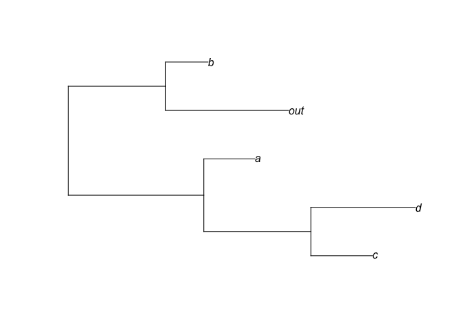<!-- -->

In the next section, we will learn more about how to plot trees.

## Plotting trees

We can do a lot with our trees in R using a few simple plot commands. We will use some of these later in the tutorial and assignment, so here's a quick introduction of some of the options you have. 

Let's try modifying the appearance of the tree using some of these arguments to `plot()`:

* `use.edge.length` (`TRUE` (default) or `FALSE`): should branch length be used to represent evolutionary distance?
* `type`: the type of tree to plot. Options include "phylogram" (default), "cladogram", "unrooted" and "fan".
* `edge.width`: sets the thickness of the branches
* `edge.color`: sets the color of the branches

See `?plot.phylo` for a comprehensive list of arguments.

You can also manipulate the contents of your tree:  

* `drop.tip()` removes a tip from the tree
* `rotate()` switches places of two tips in the visualisation of the tree (without altering the evolutionary relationship among taxa) 
* `extract.clade()` subsets the tree to a given clade


See the help pages for the functions to find out more about how they work. Now, let's use some of the options we've learned here for looking at some real data.

## Rooting

One important consideration in phylogenetic analysis is the correct placement of the *root*. To determine the root, we have included an outgroup in our analysis, labelled "out". We can reroot the tree using this taxon with the following command:


``` r
tree_rooted <- root(
     unroot(tree),
     outgroup = "out",
     resolve.root = TRUE)
plot(tree_rooted)
```

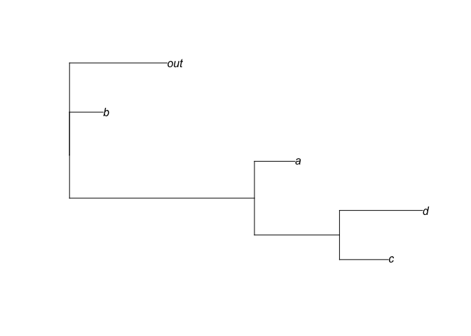<!-- -->
The tree is now rooted so that the **outgroup** is sister to all remaining taxa (the **ingroup**). However, the resulting tree may appear to show a basal trichotomy. This is actually a visualization artefact caused by the branch connecting the ingroup to the root having a length of zero. Thus, the apparent trichotomy does not reflect the topology of the tree.

We can verify this by plotting the tree without branch-length information:


``` r
plot(tree_rooted, use.edge.length = FALSE)
```

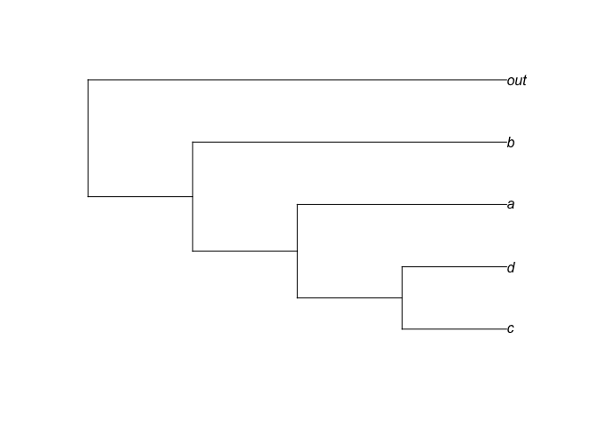<!-- -->
The resulting cladogram clearly shows that the outgroup is sister to the ingroup and that there is no basal trichotomy.

## Interpreting phylogenetic trees: cladograms, phylograms and chronograms

We will now investigate the  informaiton conveyed in different graphic representations of a tree.
First we will generate a chronogram strating from our rooted tree:


``` r
# Create illustrative chronogram
chrono <- compute.brlen(tree_rooted, method = "Grafen")

# Scale to arbitrary root age of 100 Ma
root_age <- 100
chrono$edge.length <- chrono$edge.length *
  root_age / max(node.depth.edgelength(chrono))
```

Now, let's generate a plot with the thee different types of trees


``` r
old_par <- par(no.readonly = TRUE)
par(
  mfrow = c(1, 3),
  mar = c(5, 2, 4, 1)
)
# 1. CLADOGRAM
plot(
  tree_rooted,
  use.edge.length = FALSE,
  main = "Cladogram",
  cex = 1.4
)

mtext(
  "Branch lengths have no meaning",
  side = 1, line = 3,
  cex = 1
)

# 2. PHYLOGRAM
plot(
  tree_rooted,
  main = "Phylogram",
  cex = 1.4
)

add.scale.bar(cex = 1)

mtext(
  "Evolutionary change",
  side = 1, line = 3,
  cex = 1
)

# 3. CHRONOGRAM
plot(
  chrono,
  main = "Chronogram",
  cex = 1.4
)

axisPhylo(
  backward = TRUE,
  cex.axis = 1.1
)

mtext(
  "Time before present (Ma)",
  side = 1, line = 3,
  cex = 1
)
```

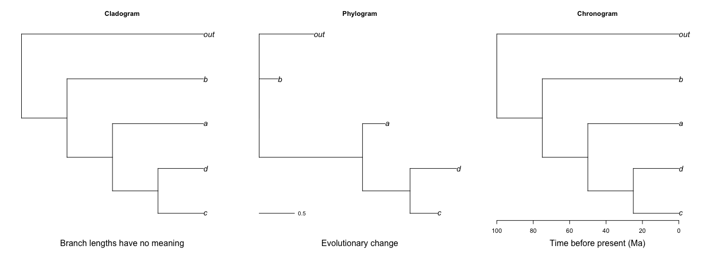<!-- -->

``` r

par(old_par)
```


## A simple example with real data - avian phylogenetics

So far, we have only looked at randomly generated trees. Let's have a look at some data stored within `ape`---a phylogeny of birds at the order level.


``` r
# get bird order data
data("bird.orders")
```

Let's plot the phylogeny to have a look at it. We will also add some annotation to make sense of the phylogeny.


``` r
# no.margin = TRUE gives prettier plots
plot(bird.orders, no.margin = TRUE)
segments(38, 1, 38, 5, lwd = 2)
text(39, 3, "Proaves", srt = 270)
segments(38, 6, 38, 23, lwd = 2)
text(39, 14.5, "Neoaves", srt = 270)
```

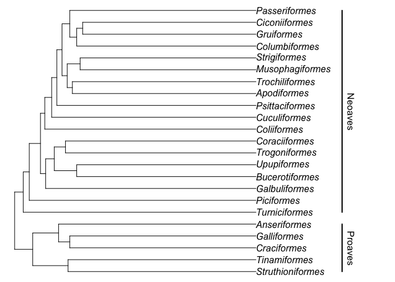<!-- -->

Here, the `segments` and `text` functions specify the bars and names of the two major groups in our avian phylogeny. We are just using them for display purposes here, but if you'd like to know more about them, you can look at the R help with `?segments` and `?text` commands.

Let's focus on the Neoaves clade for now. Perhaps we want to test whether certain families within Neoaves form a monophyletic group? We can do this with the `is.monophyletic` function.


``` r
# Parrots and Passerines?
is.monophyletic(bird.orders, c("Passeriformes", "Psittaciformes"))
#> [1] FALSE
# hummingbirds and swifts?
is.monophyletic(bird.orders, c("Trochiliformes", "Apodiformes"))
#> [1] TRUE
```

If we want to look at just the Neoaves, we can subset our tree using `extract.clade()`. We need to supply a node from our tree to `extract.clade`, so let's find the correct node first. The nodes in the tree can be found by running the `nodelabels()` function after using `plot()`:


``` r
plot(bird.orders, no.margin = TRUE)
segments(38, 1, 38, 5, lwd = 2)
text(39, 3, "Proaves", srt = 270)
segments(38, 6, 38, 23, lwd = 2)
text(39, 14.5, "Neoaves", srt = 270)
nodelabels()
```

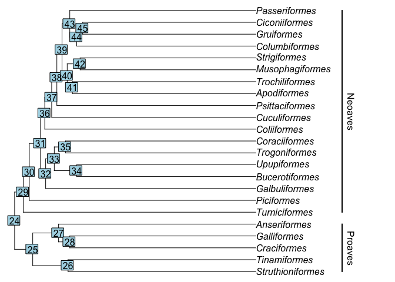<!-- -->

We can see that the Neoaves start at node 29, so let's extract that one.


``` r
# extract clade
neoaves <- extract.clade(bird.orders, 29)
# plot
plot(neoaves, no.margin = TRUE)
```

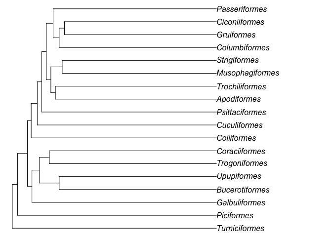<!-- -->

The functions provided by `ape` make it quite easy to handle phylogenies in R, feel free to experiment further to find out what you can do!


# Character evolution, homology and natural groups

Phylogenetic trees provide a framework for interpreting the evolution of characters. The same similarity between organisms can have very different evolutionary meanings depending on where and how the character originated.

We will use the same phylogenetic tree as before to introduce the concepts of **synapomorphy, symplesiomorphy, autapomorphy and homoplasy**, and to relate them to **monophyletic, paraphyletic and polyphyletic groups**.

Our reference topology is:

```text id="ffma11"
(out,(b,(a,(c,d))));
```

First, we remove the original branch lengths because we are interested here in the **topology and character transformations**, rather than in evolutionary distances.


``` r
tree_map <- tree_rooted
tree_map$edge.length <- NULL
plot(
  tree_map,
  use.edge.length = FALSE,
  cex = 1.4,
  main = "Reference topology"
)
```

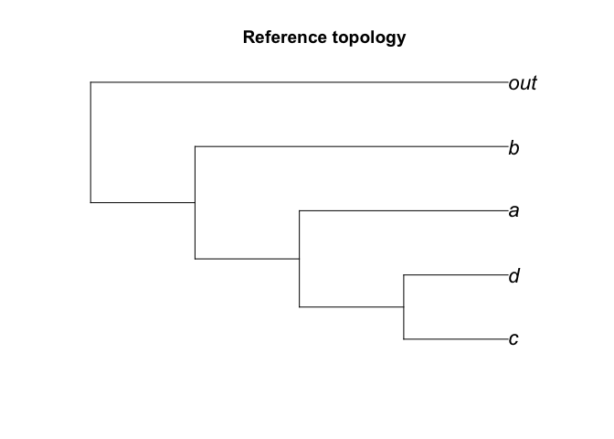<!-- -->

### A pseudo-morphological character matrix

We will create a small artificial morphological data set. The characters have been deliberately designed to illustrate different patterns of character evolution.

State `0` corresponds to the state observed in the outgroup. States `1` and, in one character, `2` represent alternative states.


``` r
morph <- data.frame(
  taxon = c("out", "b", "a", "c", "d"),

  # Synapomorphy of the entire ingroup
  antennae = c(0, 1, 1, 1, 1),

  # Synapomorphy of a + c + d
  dorsal_spine = c(0, 0, 1, 1, 1),

  # Synapomorphy of c + d
  tail_spot = c(0, 0, 0, 1, 1),

  # Autapomorphy of a
  horn = c(0, 0, 1, 0, 0),

  # Homoplasy: independent acquisition in b and c
  wings = c(0, 1, 0, 1, 0),

  # Multistate character used to illustrate transformation
  # followed by reversal
  body_covering = c(0, 0, 1, 0, 1)
)

morph
#>   taxon antennae dorsal_spine tail_spot horn wings body_covering
#> 1   out        0            0         0    0     0             0
#> 2     b        1            0         0    0     1             0
#> 3     a        1            1         0    1     0             1
#> 4     c        1            1         1    0     1             0
#> 5     d        1            1         1    0     0             1
```

### Fitch parsimony and ancestral-state reconstruction

We can reconstruct the evolution of these characters using **Fitch parsimony**.

For each internal node, the algorithm compares the possible states of its descendants. If their state sets overlap, their intersection is assigned to the ancestor. If they do not overlap, their union is assigned and an additional evolutionary transformation is required.

The following function performs the upward pass of the Fitch algorithm.


``` r
fitch_character <- function(tree, states) {

  # Reorder tree so descendants are processed before ancestors
  tr <- reorder.phylo(tree, order = "postorder")

  ntip  <- Ntip(tr)
  nnode <- Nnode(tr)

  # Object for storing possible states at every node
  state_sets <- vector("list", ntip + nnode)

  # Assign observed states to terminal taxa
  for (i in seq_len(ntip)) {
    state_sets[[i]] <- as.character(
      states[tr$tip.label[i]]
    )
  }

  score <- 0

  # Internal nodes in postorder
  internal_nodes <- unique(tr$edge[, 1])

  for (node in internal_nodes) {

    children <- tr$edge[
      tr$edge[, 1] == node, 2
    ]

    child_sets <- lapply(
      children,
      function(x) state_sets[[x]]
    )

    common_states <- Reduce(
      intersect,
      child_sets
    )

    if (length(common_states) > 0) {

      # Descendants share at least one possible state
      state_sets[[node]] <- common_states

    } else {

      # No state is shared: one additional step is required
      state_sets[[node]] <- Reduce(
        union,
        child_sets
      )

      score <- score + 1
    }
  }

  list(
    tree  = tr,
    sets  = state_sets,
    score = score
  )
}
```

The upward pass determines the possible states at each internal node and the minimum number of transformations required by the character.

We now perform a downward pass to obtain one particular most-parsimonious reconstruction.


``` r
resolve_fitch <- function(fitch_result,
                          root_state = NULL) {

  tr <- fitch_result$tree
  state_sets <- fitch_result$sets

  ntip  <- Ntip(tr)
  nnode <- Nnode(tr)

  assigned <- rep(
    NA_character_,
    ntip + nnode
  )

  # Identify the root
  root <- setdiff(
    tr$edge[, 1],
    tr$edge[, 2]
  )[1]

  # Choose root state
  if (is.null(root_state)) {

    assigned[root] <- state_sets[[root]][1]

  } else {

    root_state <- as.character(root_state)

    if (!root_state %in% state_sets[[root]]) {
      warning(
        "Specified root state is not included ",
        "in the Fitch set at the root."
      )
    }

    assigned[root] <- root_state
  }

  # Reorder tree from root towards tips
  tr_pre <- reorder.phylo(
    tr,
    order = "cladewise"
  )

  for (i in seq_len(nrow(tr_pre$edge))) {

    parent <- tr_pre$edge[i, 1]
    child  <- tr_pre$edge[i, 2]

    if (child <= ntip) {

      # Terminal states are observed
      assigned[child] <- state_sets[[child]][1]

    } else {

      # Prefer the parental state whenever possible
      if (assigned[parent] %in%
          state_sets[[child]]) {

        assigned[child] <- assigned[parent]

      } else {

        assigned[child] <-
          state_sets[[child]][1]
      }
    }
  }

  assigned
}
```

Finally, we create a function that plots the observed states at the tips, reconstructed ancestral states at the internal nodes, and inferred transformations on the branches.


``` r
plot_fitch <- function(tree,
                       states,
                       character_name,
                       root_state = "0") {

  # Fitch reconstruction
  fit <- fitch_character(tree, states)

  reconstructed <- resolve_fitch(
    fit,
    root_state = root_state
  )

  tr <- fit$tree

  ntip  <- Ntip(tr)
  nnode <- Nnode(tr)

  # --------------------------------------------------
  # Create labels containing taxon + observed state
  # --------------------------------------------------

  original_labels <- tr$tip.label

  tr$tip.label <- paste0(
    original_labels,
    "  [",
    reconstructed[seq_len(ntip)],
    "]"
  )

  # --------------------------------------------------
  # Plot tree
  # --------------------------------------------------

  plot(
    tr,
    use.edge.length = FALSE,
    show.tip.label = TRUE,
    cex = 1.3,
    label.offset = 0.1,
    main = paste0(
      character_name,
      "   [minimum steps = ",
      fit$score,
      "]"
    )
  )

  # --------------------------------------------------
  # Reconstructed states at internal nodes
  # --------------------------------------------------

  internal <- (ntip + 1):(ntip + nnode)

  nodelabels(
    text = reconstructed[internal],
    node = internal,
    frame = "circle",
    bg = "lightgrey",
    cex = 1
  )

  # --------------------------------------------------
  # Show transformations on branches
  # --------------------------------------------------

  for (i in seq_len(nrow(tr$edge))) {

    parent <- tr$edge[i, 1]
    child  <- tr$edge[i, 2]

    if (reconstructed[parent] != reconstructed[child]) {

transformation <- paste0(
  reconstructed[parent],
  " -> ",
  reconstructed[child]
)

      edgelabels(
        text = transformation,
        edge = i,
        frame = "none",
        cex = 1,
        font = 2
      )
    }
  }

  invisible(
    list(
      score = fit$score,
      states = reconstructed,
      tree = tr
    )
  )
}
```

---

### Synapomorphy: a shared derived character

A **synapomorphy** is a derived character state shared by two or more taxa and inherited from their most recent common ancestor.

Consider the dorsal spine:


``` r
spine <- setNames(
  morph$dorsal_spine,
  morph$taxon
)

plot_fitch(
  tree_map,
  spine,
  "Dorsal spine"
)
```

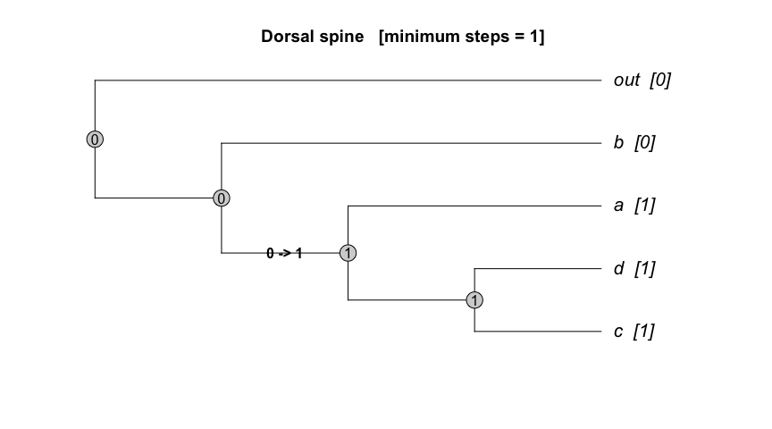<!-- -->

Only one transformation is required:

`0 → 1`

It occurs in the common ancestor of `a`, `c` and `d`.

The presence of the dorsal spine is therefore a **synapomorphy of the clade `a + c + d`**.

---

### Nested synapomorphies

The presence of a tail spot has a more restricted distribution:


``` r
tail <- setNames(
  morph$tail_spot,
  morph$taxon
)

plot_fitch(
  tree_map,
  tail,
  "Tail spot"
)
```

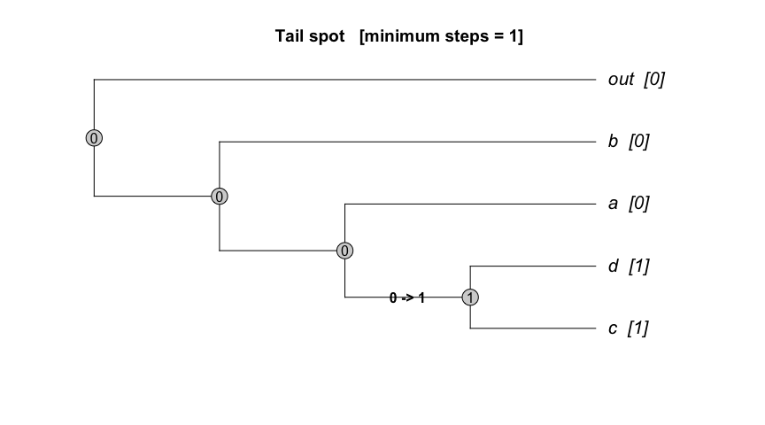<!-- -->

The derived state originates in the common ancestor of `c` and `d`.

It is therefore a **synapomorphy of the clade `c + d`**.

Notice that phylogenetic trees contain **nested sets of synapomorphies**:

```text
antennae
+-- b + a + c + d
    |
    dorsal spine
    +-- a + c + d
        |
        tail spot
        +-- c + d
```


This hierarchical distribution of derived characters reflects the hierarchical structure of phylogenetic relationships.

---

### Symplesiomorphy: a shared ancestral character

Whether a character is a synapomorphy or a symplesiomorphy depends on the **phylogenetic level being considered**.

Consider antennae:


``` r
antennae <- setNames(
  morph$antennae,
  morph$taxon
)

plot_fitch(
  tree_map,
  antennae,
  "Antennae"
)
```

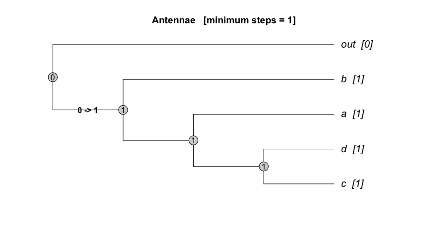<!-- -->


The presence of antennae originated in the common ancestor of the entire ingroup:

`b + a + c + d`


It is therefore a **synapomorphy of the ingroup**.

However, if we consider only:

`a + c + d`


the presence of antennae is ancestral to that group because it was already present before its common ancestor originated.

Within `a + c + d`, antennae therefore represent a **symplesiomorphy**.

This illustrates an important point: the terms synapomorphy and symplesiomorphy are **relative to the group being considered**.

---

### Autapomorphy: a uniquely derived character

An **autapomorphy** is a derived state restricted to a single terminal lineage.

Consider the horn:


``` r
horn <- setNames(
  morph$horn,
  morph$taxon
)

plot_fitch(
  tree_map,
  horn,
  "Horn"
)
```

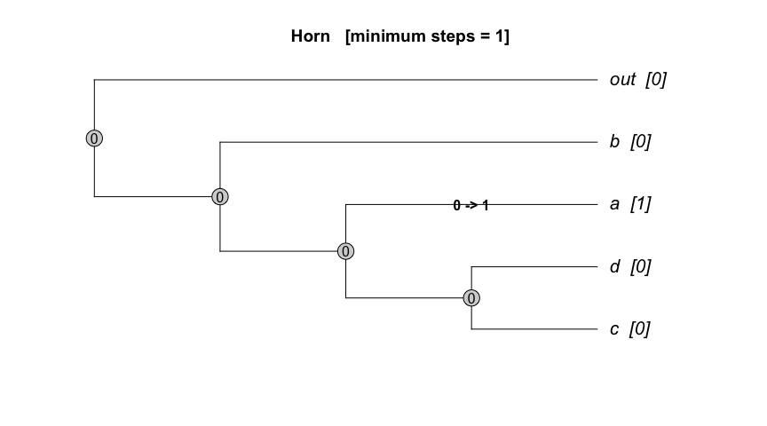<!-- -->

The transformation occurs only on the terminal branch leading to `a`.

The presence of a horn is therefore an **autapomorphy of `a`**.

Autapomorphies can diagnose individual taxa, but they do not provide evidence for relationships among terminal taxa.

---

### Homoplasy: independent origins

Not all similarities result from inheritance from a common ancestor.

Consider wings:


``` r
wings <- setNames(
  morph$wings,
  morph$taxon
)

plot_fitch(
  tree_map,
  wings,
  "Wings"
)
```

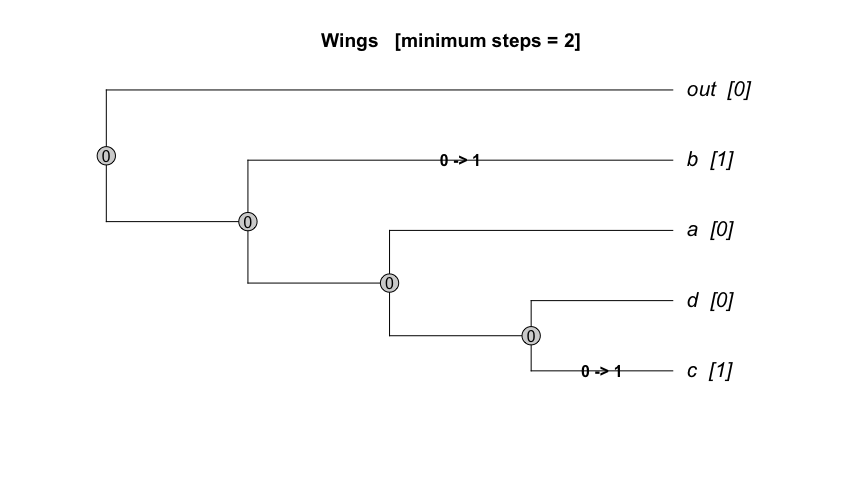<!-- -->

Wings are present in `b` and `c`, although these taxa do not form a clade.

The minimum reconstruction requires two transformations:

```text
0 → 1     in b

0 → 1     in c
```


The presence of wings in these two taxa is therefore **homoplastic**: the derived state originated independently.

Depending on the biological and developmental context, independent origins of similar structures may be described as **convergence** or **parallel evolution**. Their distinction cannot generally be established from this simple binary character distribution alone.

---

### Homoplasy through evolutionary reversal

Homoplasy can also result from the loss of a previously acquired derived state.

To illustrate this unambiguously, we will construct a character whose derived state originated in the ancestor of `a + c + d`, but was subsequently lost in `c`.

Rather than inferring this history solely from an ambiguous terminal distribution, we explicitly define the evolutionary scenario:


``` r
reversal <- c(
  out = 0,
  b   = 0,
  a   = 1,
  c   = 0,
  d   = 1
)

reversal
#> out   b   a   c   d 
#>   0   0   1   0   1
```

A possible most-parsimonious history is:

```text
             0 -> 1
                |
                +-- a = 1
                |
                +--+
                   |
                   +-- c = 0  (1 -> 0)
                   |
                   +-- d = 1
``` 

We can examine the Fitch reconstruction:


``` r
reversal_fit <- plot_fitch(
  tree_map,
  reversal,
  "Character loss / reversal"
)
```

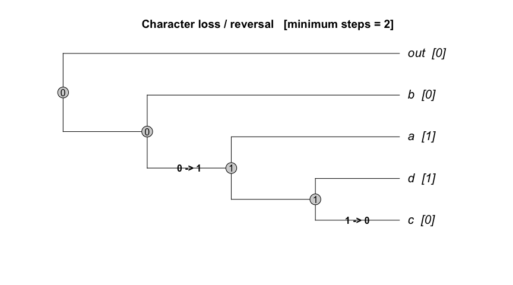<!-- -->

This character requires two transformations. However, an important property of parsimony is visible here: **the terminal distribution alone may allow alternative equally parsimonious reconstructions**.

Therefore, a reversal should not automatically be inferred simply because a taxon lacks a character present in related taxa.

A **reversal** specifically refers to a transformation from a derived state back to an ancestral-like state:

```
0 → 1 → 0
```

The resulting similarity between the reversed lineage and taxa retaining the ancestral state is a form of **homoplasy**.

---

## Comparing character histories

We can display the main patterns together.


``` r
old_par <- par(no.readonly = TRUE)

par(
  mfrow = c(2, 2),
  mar = c(1, 1, 3, 1)
)

plot_fitch(
  tree_map,
  setNames(
    morph$dorsal_spine,
    morph$taxon
  ),
  "Synapomorphy"
)

plot_fitch(
  tree_map,
  setNames(
    morph$horn,
    morph$taxon
  ),
  "Autapomorphy"
)

plot_fitch(
  tree_map,
  setNames(
    morph$wings,
    morph$taxon
  ),
  "Independent origins"
)

plot_fitch(
  tree_map,
  reversal,
  "Reversal / ambiguity"
)
```

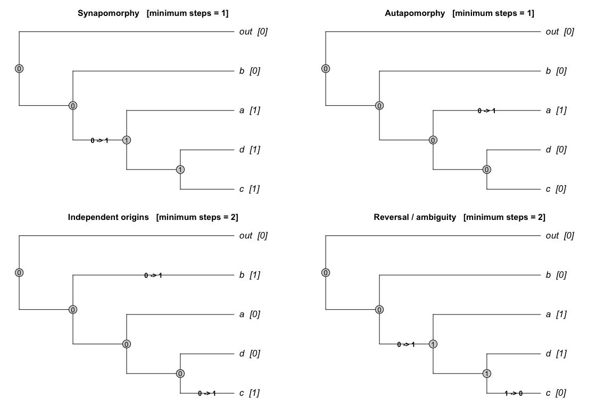<!-- -->

``` r

par(old_par)
```

The numbers at the tips represent the **observed character states**. Numbers at internal nodes represent one most-parsimonious reconstruction of ancestral states. Labels on branches indicate inferred transformations.

---

### Homology and homoplasy

We can now distinguish several important concepts:

| Concept | Interpretation |
|---|---|
| **Synapomorphy** | Shared derived state inherited from the common ancestor of a clade |
| **Symplesiomorphy** | Shared ancestral state |
| **Autapomorphy** | Derived state restricted to a single lineage |
| **Homoplasy** | Similarity not resulting from inheritance of that derived state from the relevant common ancestor |
| **Convergence** | Independent evolution of similar features, generally from different ancestral conditions |
| **Parallelism** | Independent evolution of similar features from similar ancestral/developmental conditions |
| **Reversal** | Return from a derived state to an ancestral-like state |

An important distinction is therefore:

> **Homology refers to similarity due to common ancestry, whereas homoplasy refers to similarity produced by independent evolutionary changes or reversal.**

---

## Character evolution and phylogenetic grouping

Character evolution can now be related directly to the recognition of groups.

Our topology is:

```text
(out,(b,(a,(c,d))));
```

A **monophyletic group**, or clade, contains a common ancestor and **all of its descendants**.

Examples include:

```text
{c, d}

{a, c, d}

{b, a, c, d}
```

For example, `c + d` is supported in our artificial data set by the synapomorphy:

```text
tail spot: 0 → 1
```

and `a + c + d` is supported by:

```text
dorsal spine: 0 → 1
```

---

### Paraphyletic groups

A **paraphyletic group** contains a common ancestor but excludes one or more of its descendants.

For example:

```text
{a, c}
```

does not form a clade because the most recent common ancestor of `a` and `c` also has `d` as a descendant.

Similarly:

```text
{b, a, c}
```

excludes `d`, even though `d` is also a descendant of their common ancestor.

These groups are therefore **paraphyletic**.

---

### Polyphyletic groups

A **polyphyletic group** combines taxa from separate branches based on similarities that do not diagnose their most recent common ancestor as an exclusive group.

The winged taxa provide an example:

```text
{b, c}
```

Both possess wings, but they do not form a clade.

Our character reconstruction showed that wings evolved independently:

```text
b     0 → 1

c     0 → 1
```

Grouping `b` and `c` because they possess wings would therefore create a **polyphyletic group based on homoplasy**.

---

### Character evolution and phylogenetic groups

We can summarize the relationship between characters and groups as follows:

| Character evidence | Evolutionary interpretation | Phylogenetic relevance |
|---|---|---|
| Synapomorphy | Shared derived state | Evidence for a clade |
| Symplesiomorphy | Shared ancestral state | Does not diagnose the more restricted clade |
| Autapomorphy | Unique derived state | Diagnoses a terminal lineage |
| Homoplasy | Independent similarity | Can misleadingly suggest relationships |
| Reversal | Secondary return to ancestral-like state | Can obscure phylogenetic relationships |

The central principle is that **shared derived characters (synapomorphies), rather than similarity per se, provide evidence for common ancestry and monophyletic groups**.

This is why reconstructing character evolution on a phylogenetic tree is essential for distinguishing **homology from homoplasy** and **natural groups from artificial assemblages**.

\newpage

# ---SESSION 2---

# Inferring trees with R using parsimony


So far, we have only looked at examples of trees that are already constructed in some way. However, if you are working with your own data, this is not the case - you need to actually make the tree yourself. Luckily, `phangorn` is ideally suited for this. We will use some data, bundled with the package, for the next steps. In this example, we will investigate the phylogenetic relationships of *Parachtes* a genus belonging to the spider family Dysderidae by using a concatenated matrix of 6 mtDNA genes, namely cox1, nad1, 16S and 12S and 3 nuclear genes, 18S, 28S and Histone3, obtained from Genbank. 

The following code loads the data as phyDat object:


``` r
# get parachtes data
parachtes <- read.phyDat("ParALL153.fas", format = "fasta")
```

## Tree search
There are three different search strategies:

1. **Exhaustive search** (sometimes also referred as implicit enumeration, e.g. in TNT): It does guarantee the shortest tree, but there is usually a taxa limit, depending on the program used (~15). In the case of `phagorn` the usage would be `bab(data, tree = NULL, trace = 0, ...)`

2. **Heuristic search**: does not guarantee finding the shortest tree. It usually consists of two rounds: (1) you build a tree (using different strategies, e.g., random addition of taxa, Wagner tree, etc.), (2) you conduct *branch swapping*, an algorithm that exchange branches of the initial tree to look for shorter trees. There are different branch swapping strategies, ranging from lighter to more thorough rearrangements: `NNi`,` SPR`, `TBR`. In `phangorn`, you can use `random.addition` to compute a starting tree. The function `optim.parsimony` performs tree rearrangements to find trees with a lower parsimony score. The tree rearrangements implemented are nearest-neighbor interchanges (`NNI`) and subtree pruning and regrafting (`SPR`). The latter so far only works with the Fitch algorithm. We iterate these procedures many times (e.g., more than 100).

3. **New search strategies**: these are optimised algorithm for heuristic searchers of large data matrices (e.g. >100 taxa). There are several strategies  In this practical, we will implement *parsimony ratchet*. The function is `pratchet`, an implementation of the parsimony ratchet (Nixon 1999). This allows to escape local optima and find better trees than only performing NNI / SPR rearrangements.

The current implementation is:

1. Create a bootstrap data set $D_b$ from the original data set.
2. Take the current best tree and perform tree rearrangements on $D_b$ and save bootstrap tree as $T_b$ .
3. Use 𝑇𝑏and perform tree rearrangements on the original data set. If this tree has a lower parsimony score than the currently best tree, replace it.
4. Iterate 1:3 until either a given number of iteration is reached (minit) or no improvements have been recorded for a number of iterations (k).


Now that we have inferred the MP tree, we should plot it to have a look. 


``` r
# plot MP tree
plot(treeRatchet,no.margin = TRUE)
```

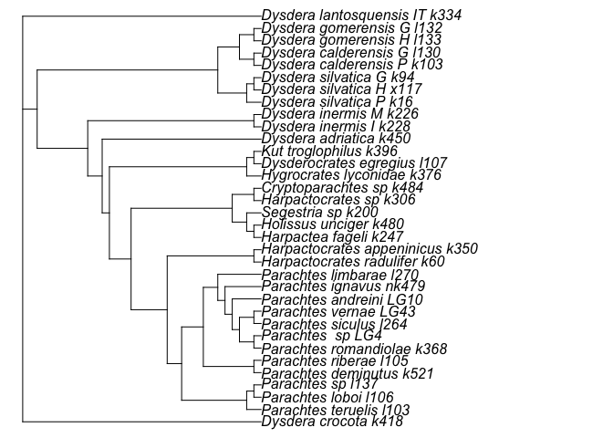<!-- -->

### Tree rooting

Notice that so far we have not define which species is the outgroup for the analysis. By default the first taxon in the matrix is assigned as outgroup. Also, notice that even if show the tree as rooted, the analyses infer trees that are unrooted. We can verify that the tree is unrooted using the `is.rooted()` function.


``` r
# check whether the tree is rooted
is.rooted(treeRatchet)
```

We can also set a root on our tree, if we know what we should set the outgroup to. In our case, we can set our outgroup to **Segestria_sp_k200**.

We will set the root of our tree  using the `root` function and we'll then plot it to see how it looks.


``` r
# plot treeRatchet rooted
treeRatchet_r <- root(treeRatchet, "Segestria_sp_k200", resolve.root = TRUE, edgelabel = TRUE)
plot(treeRatchet_r, no.margin = TRUE)
```

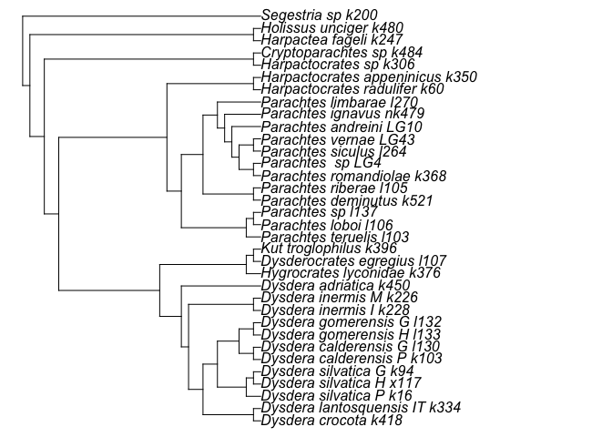<!-- -->

Notice that the tree remains the same, you can move the root to any other node, and the tree is fully equivalent. You can check that by asking again about the length of the tree with the new root.


``` r
# reporting tree length (steps)
parsimony(treeRatchet_r, parachtes)
#> [1] 7893
```

### Branch lengths

Also, observe that this is tree  only inform about the topology. If we wanted to also include the number of substitution in each branch (i.e. branch length), we have to do the following:


``` r
# perform character optimization
treeRatchet_r<-acctran(treeRatchet_r, parachtes)
```

This function assigns edge weights. We now plot the tree with the corresponding branch length information:


``` r
# plot the rooted tree with branch lengths
plot(treeRatchet_r, type="phylogram", no.margin = TRUE)
add.scale.bar()
```

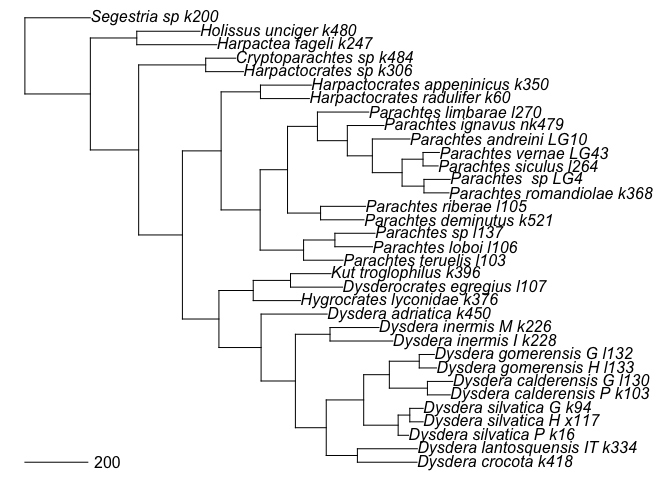<!-- -->

### Exporting a tree

Now that we have our tree properly rooted and with branch lengths, we can easily write it to a file in `Newick` format:

``` r
# rooted tree with branch lengths
write.tree(treeRatchet_r, "parachtes.tre")
```

## Consensus tree

Sometimes we find more than one equally parsimonious tree. In those cases, we usually calculate the strict consensus tree, which helps visualize the conflict among the best trees. In our case, we found one single shortest tree, but we can pretend to have a second one by generating a new tree using random addition of taxa, which is generally suboptimal, and a second one optimizing the first with an SPR swapper.


Let's compare the legth of the two former trees


``` r
# compare the length of the trees
parsimony(c(treeRA, treeSPR), parachtes)
#> [1] 7894 7893
```

To find out what are the topological differences of the two trees, we can look at the strict consensus from treeRA and treeSPR, using the command `consensus` function from `ape`.


``` r
#combines both trees into a single object
obj<-c(treeRA, treeSPR)
# Calculate and plot the consensus tree
obj_cons <- root(consensus(obj), outgroup = "Segestria_sp_k200",resolve.root = TRUE, edgelabel =TRUE)
plot(obj_cons, main="Rooted pratchet consensus tree",no.margin = TRUE)
```

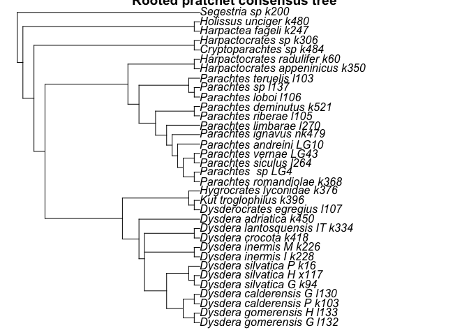<!-- -->

We can  see that the source of conflict lays within the *Dysdera* genus

\newpage

# ---SESSION 3---

# Gaps

So far we have conducted all parsimony analyses assuming gap are missing data, which is the default option. However, we may want to investigate if our inferences would change if gaps were scored as an additional character state. We can do this by using the following commands:


``` r
#indicate gaps defined as "-" are a new state and that "n" and "?" should be considered missing data
parachtes_5<-gap_as_state(parachtes, gap = "-", ambiguous = c("n","?"))
```

Similarly, we can decide to score gaps as an alternative absence/presence character, following the simple coding method proposed by Simmons & Ochoterena. 2000. We will. use the `ìps`package command `code.simple.gaps`. Note that the gapped positions are excluded from the matrix, and therefore the new matrix would have a different number of characters


``` r
#First, we will transform our parachtes matrix from a phyDat class object to a DNAbin class object
parachtes_DNAbin<-as.DNAbin(parachtes)
#Now we car recode the gaps as absence/presence data
parachtes_DNAbin_ap<-code.simple.gaps(parachtes_DNAbin)
#Finally, we will transform the new matrix with the recoded gaps back into a phyDat object
parachtes_ap<-as.phyDat(parachtes_DNAbin_ap)
```
The new coding has generated 33 additional characters, and has removed 42 positions of the original 4398

# Node support

Inference methods like Parsimony and Maximum Likelihood produce one or more best trees that meet certain optimality criteria, such as being the shortest tree or best explaining the data given a specific evolutionary model. However, we may need to assess the impact of character undersampling (random error) on our results. Specifically, we want to determine the support for the nodes recovered in the preferred tree(s). One way to do this is by using **resampling techniques**. 

These techniques involve generating pseudoreplicates (ideally >100) of our original matrix either by resampling characters with repetition (*bootstrap*) or by randomly removing a proportion of the original matrix (*Jaccknife*). For each matrix, we find the best tree(s). Finally, we determine the node support by estimating the proportion of time that each node is recovered in the resampled trees. We will estimate node support using resampling with the package `TreeSearch`.

The package includes a more intensive version of the parsimony ratchet strategy for estimating the most parsimonious tree. we will first implement this strategy using the follwoing commands:


### Node support based on Jaccknife resampling

We will now estimate the node support using Jackknife. This is similar to Bootstrap, the most widely resampling method  for finding node support. It just differs by the type of resampling implemented, removal instead of resampling with repetition. If you want to use bootstrap instead, just replace `method = "jack"` by `method = "bootstrap"`.


``` r
set.seed(123)
nReplicates <- 10

jackTrees <- replicate(
  nReplicates,
  c(TreeSearch::Resample(
    parachtes,
    method = "jack",
    proportion = 2 / 3,
    ratchIter = 2,
    tbrIter = 2,
    startIter = 1,
    maxHits = 5,
    maxTime = Inf,
    verbosity = 0
  )),
  simplify = FALSE
)

saveRDS(jackTrees, "jackTrees.rds")
```

Now we must decide what to do with the multiple optimal trees from each replicate. Alternatives are:

1. Treat each tree equally

`JackLabels(ape::consensus(trees), unlist(jackTrees, recursive = FALSE))`

2. Take the strict consensus of all trees for each replicate

`JackLabels(ape::consensus(trees), lapply(jackTrees, ape::consensus))`

3. Take a single tree from each replicate (the first; order's irrelevant)

`JackLabels(ape::consensus(trees), lapply(jackTrees, `[[`, 1))`


``` r

# Load previously calculated jackknife trees
jackTrees <- readRDS("jackTrees.rds")

#Take the strict consensus of all trees for each replicate
jackTrees_consensus<-lapply(jackTrees, consensus)

#Reroot the resampled trees using the proper outgroup
jackTrees_consensus_r <- lapply(jackTrees_consensus, function(tree) {
    root(tree, "Segestria_sp_k200", resolve.root = TRUE, edgelabel = TRUE)
})

#Map the support values on the best tree

plot(parachtes_tre_r[[1]], no.margin = TRUE)
JackLabels(parachtes_tre_r[[1]], jackTrees_consensus_r,add=TRUE)
```

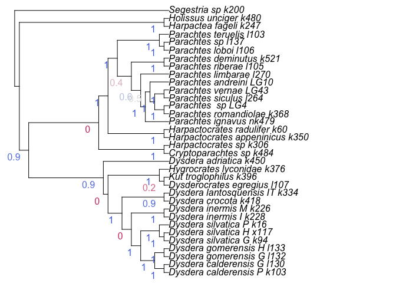<!-- -->


# Test congruence among data partitions via ILD test

There is currently no R function to perform the ILD test in any R package. We will create a function (ild_test_dnabin) using the following R script:


``` r

# Main ILD (Farris PHT) style test:
# - aln_bin: DNAbin alignment (rows = taxa, cols = sites; same taxa order across all sites)
# - parts: named list of integer vectors of site indices (original column positions)
# - nperm: number of permutations (e.g., 99, 199, 999)
# - pratchet_iter: iterations for MP search (balance speed/quality)
# Returns observed stat, null distribution, and p-value.
  
ild_test_dnabin <- function(aln_bin, parts, nperm = 99, seed = 1,
                            pratchet_iter = 50, tree_comb = NULL, quiet = FALSE) {
  set.seed(seed)

# ----- checks -----
  if (!inherits(aln_bin, "DNAbin"))
    stop("aln_bin must be DNAbin (use ape::read.dna).")

  L <- ncol(aln_bin)
  if (is.null(L) || L < 2) stop("Alignment must have >= 2 sites.")
  if (!is.list(parts) || length(parts) < 2)
    stop("Provide >= 2 partitions in 'parts'.")

  sizes <- vapply(parts, length, 1L)
  if (sum(sizes) != L) {
    stop(sprintf("Sum of partition sizes (%d) != alignment length (%d).", sum(sizes), L))
  }

# Bounds check
  max_idx <- max(unlist(parts))
  min_idx <- min(unlist(parts))
  if (min_idx < 1 || max_idx > L) {
    stop(sprintf("Partition indices out of bounds: allowed 1..%d, got [%d..%d].", L, min_idx, max_idx))
  }

  # Helper for MP length
  mp_tree_length <- function(aln_bin, pratchet_iter = 50, fixed_tree = NULL) {
    dat <- as.phyDat(aln_bin)
    if (is.null(fixed_tree)) {
      tr <- pratchet(dat, maxit = pratchet_iter)
    } else {
      tr <- fixed_tree
    }
    parsimony(tr, dat)
  }

# ----- observed statistic -----
# Combined tree length: use precomputed if given
  if (!is.null(tree_comb)) {
    if (!inherits(tree_comb, "phylo"))
      stop("tree_comb must be a 'phylo' object.")
    TL_comb <- mp_tree_length(aln_bin, fixed_tree = tree_comb)
  } else {
    TL_comb <- mp_tree_length(aln_bin, pratchet_iter)
  }

  # Sum of MP lengths from separate partitions (each optimized separately)
  TL_sep <- sum(sapply(parts, function(p)
    mp_tree_length(aln_bin[, p, drop = FALSE], pratchet_iter)))

  stat_obs <- TL_sep - TL_comb
  if (!quiet) cat(sprintf("Observed (TL_sep - TL_comb) = %.3f\n", stat_obs))

# ----- permutation test -----
  all_sites <- unlist(parts, use.names = FALSE)
  null_vals <- numeric(nperm)
  pb <- if (!quiet) txtProgressBar(min = 0, max = nperm, style = 3) else NULL

  for (i in seq_len(nperm)) {
    perm <- sample(all_sites, length(all_sites), replace = FALSE)
    # repartition
    idx_list <- vector("list", length(sizes))
    start <- 1
    for (k in seq_along(sizes)) {
      idx_list[[k]] <- perm[start:(start + sizes[k] - 1)]
      start <- start + sizes[k]
    }
# recompute TL_sep_perm
    TL_sep_perm <- sum(sapply(idx_list, function(p)
      mp_tree_length(aln_bin[, p, drop = FALSE], pratchet_iter)))
    null_vals[i] <- TL_sep_perm - TL_comb
    if (!quiet) setTxtProgressBar(pb, i)
  }
  if (!quiet) close(pb)

  # Right-tailed p-value as in PAUP*: proportion of permuted >= observed
  
  p_val <- (sum(null_vals >= stat_obs) + 1) / (nperm + 1)

  out <- list(stat_obs = stat_obs, null = null_vals, p_value = p_val,
              TL_sep = TL_sep, TL_comb = TL_comb,
              nperm = nperm, sizes = sizes,
              tree_comb = tree_comb)
  class(out) <- "ILDdnabin"
  out
}

# Pretty print
print.ILDdnabin <- function(x, ...) {
  cat("ILD (DNAbin) permutation test\n")
  cat(sprintf("  Observed: TL_sep - TL_comb = %.3f\n", x$stat_obs))
  cat(sprintf("  Permutations: %d\n", x$nperm))
  cat(sprintf("  p-value (right-tailed): %.4f\n", x$p_value))
  invisible(x)
}

# Quick plot for the null distribution
plot.ILDdnabin <- function(x, ...) {
  hist(x$null, breaks = "FD", main = "ILD null distribution",
       xlab = "TL_sep_perm - TL_comb", col = "grey80", border = "white")
  abline(v = x$stat_obs, col = "red", lwd = 2)
  mtext(sprintf("Observed = %.3f; p = %.4f", x$stat_obs, x$p_value), col = "red", line = 0.5)
}

```

1. We will read the alignment into a `DNAbin` object because `phyDat` format condenses the columns by patterns, which makes it difficult to assign original partitions


``` r
aln_bin <- read.dna("ParALL153.fas", format = "fasta")
```

2. Select one of the previously inferred most-parsimonious trees for the combined alignment.


``` r
mp_tree_comb <- parachtes_tre[[1]]
```

3. We will define partitions by ORIGINAL column indices (must cover all columns). In this example, we will compare the mtDNA genes (COI, 12S, 16S, which correspond to the first 2731 positions) versus the nuc genes (18S, 28S, H3)


4. We can now run the ILD test. Note that we have to define the number of permutations (nperm); the more, the better—usually 1000 is the minimum. However, in this example, to avoid spending too much time, we will only run 100 permutations (99 plus the observed partition lengths).


``` r
res <- ild_test_dnabin(
  aln_bin, parts,
  nperm = 99,
  pratchet_iter = 50,
  tree_comb = mp_tree_comb,
  quiet = FALSE
)
saveRDS(res, "ild_result.rds")
```

5. We can now inspect the results


``` r
res <- readRDS("ild_result.rds")
print(res)
#> ILD (DNAbin) permutation test
#>   Observed: TL_sep - TL_comb = -58.000
#>   Permutations: 99
#>   p-value (right-tailed): 0.4600
plot(res)
```

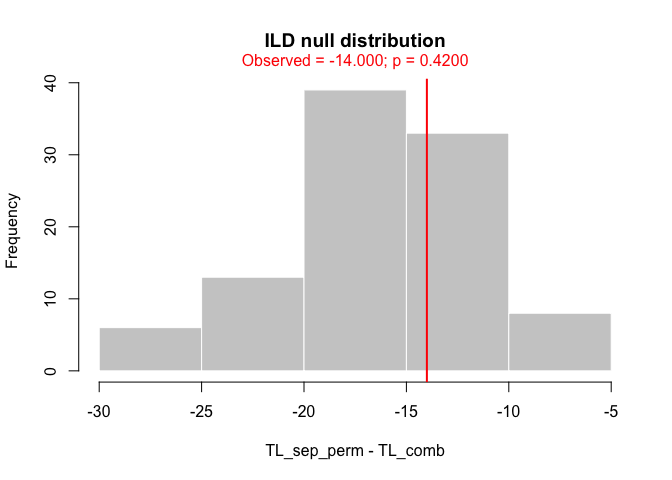<!-- -->


# Exercises

1. Find the most parsimonious tree, considering gaps as absence/presence. Properly root the tree and report the tree, indicating the number of steps (length). 
2. Assess the node support using Jackknife. 
3. Finally, test if the moleculars and the recoded gap partitions are congruent.

In the CV, use the task option to submit your answer


