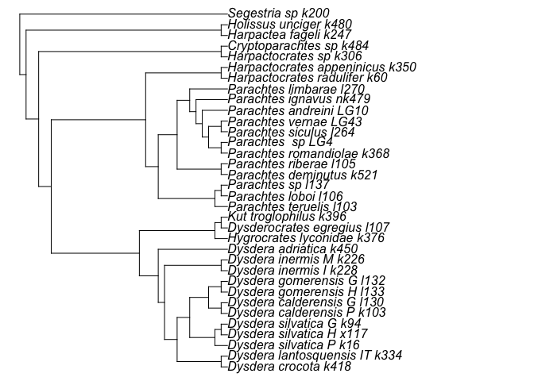

### Credits
This exercise is based on the R tutorial for course [BIOS1140](https://bios1140.github.io/) at the University of Oslo aand examples provided in the github of [`phangorn`](https://github.com/KlausVigo/phangorn/blob/master/vignettes/Morphological.Rmd) by Klaus Schliep


### What to expect
In this tutorial, we will introduce phylogenetics  as a means to visualise the evolutionary relationships among species and will coduct our first phylogenetic analyses using parismony as method of inference
In this section we will:

-   learn some tools for visualising phylogenetic trees
-   learn how to create phylogenies

### Getting started

First, we need to set up our R environment. We'll load `tidyverse` a package that facilitaes dta amaipulation and visualization. aalong a few more packages today to help us handle different types of data. Chief among these is `ape` which is the basis for a lot of phylogenetic analysis in R. We will also load another phylogenetic package, `phangorn` (which has an extremely [geeky reference](https://en.wikipedia.org/wiki/Fangorn) in its name).


``` r
# clear the R environment
rm(list = ls())

# install new packages
install.packages("ape")
install.packages("phangorn")
install.packages("tidyverse")

# load packages
library(ape)
library(phangorn)
library(tidyverse)
```

With these packages installed, we are ready to begin!

## Phylogenetics in R


R has a number of extremely powerful packages for performing phylogenetic analysis, from plotting trees to testing comparative models of evolution. You can see [here](https://cran.r-project.org/web/views/Phylogenetics.html) for more information if you are interested in learning about what sort of things are possible. For today's session, we will learn how to handle and visualise phylogenetic trees in R. We will also construct a series of trees from a sequence alignment. First, let's familiarise ourselves with how R handles phylogenetic data.

### Storing trees in R

The backbone of most phylogenetic analysis in R comes from the functions that are part of the `ape` package. `ape` stores trees as `phylo` objects, which are easy to access and manipulate. The easiest way to understand this is to have a look at a simple phylogeny, so we'll create a random tree now.


``` r
# set seed to ensure the same tree is produced
set.seed(32)
# generate a tree
tree <- rtree(n = 4, tip.label = c("a", "b", "c", "d"))
```

What have we done here? First, the `set.seed` function just sets a seed for our random simulation of a tree. You won't need to worry about this for the majority of the time, here we are using it to make sure that when we randomly create a tree, we all create the same one.

What you need to focus on is the second line of code that uses the `rtree` function. This is simply a means to generate a random tree. With the `n = 4` argument, we are simply stating our tree will have four taxa and we are already specifying what they should be called with the `tip.label` argument.

Let's take a closer look at our `tree` object. It is a `phylo` object - you can demonstrate this to yourself with `class(tree)`.


``` r
tree
#> 
#> Phylogenetic tree with 4 tips and 3 internal nodes.
#> 
#> Tip labels:
#>   c, a, d, b
#> 
#> Rooted; includes branch lengths.
```

By printing `tree` to the console, we see it is a tree with 4 tips and 3 internal nodes, a set of tip labels. We also see it is rooted and that the branch lengths are stored in this object too.

You can actually look more deeply into the data stored within the `tree` object if you want to. Try the following code and see what is inside.


``` r
str(tree)
objects(tree)
tree$edge
tree$edge.length
```

It is of course, much easier to understand a tree when we visualise it. Luckily this is easy in R.


``` r
plot(tree)
```

<!-- -->

In the next section, we will learn more about how to plot trees.

### Plotting trees

We can do a lot with our trees in R using a few simple plot commands. We will use some of these later in the tutorial and assignment, so here's a quick introduction of some of the options you have. 

First, let's generate another random tree, this time with 5 taxa.


``` r
# set seed to ensure the same tree is produced
set.seed(32)
# generate a tree
tree <- rtree(n = 5, tip.label = c("a", "b", "c", "d", "e"))
```

Now, try modifying the appearance of the tree using some of these arguments to `plot()`:

* `use.edge.length` (`TRUE` (default) or `FALSE`): should branch length be used to represent evolutionary distance?
* `type`: the type of tree to plot. Options include "phylogram" (default), "cladogram", "unrooted" and "fan".
* `edge.width`: sets the thickness of the branches
* `edge.color`: sets the color of the branches

See `?plot.phylo` for a comprehensive list of arguments.

You can also manipulate the contents of your tree:  

* `drop.tip()` removes a tip from the tree
* `rotate()` switches places of two tips in the visualisation of the tree (without altering the evolutionary relationship among taxa) 
* `extract.clade()` subsets the tree to a given clade

See the help pages for the functions to find out more about how they work. Now, let's use some of the options we've learned here for looking at some real data.

### A simple example with real data - avian phylogenetics

So far, we have only looked at randomly generated trees. Let's have a look at some data stored within `ape`---a phylogeny of birds at the order level.


``` r
# get bird order data
data("bird.orders")
```

Let's plot the phylogeny to have a look at it. We will also add some annotation to make sense of the phylogeny.


``` r
# no.margin = TRUE gives prettier plots
plot(bird.orders, no.margin = TRUE)
segments(38, 1, 38, 5, lwd = 2)
text(39, 3, "Proaves", srt = 270)
segments(38, 6, 38, 23, lwd = 2)
text(39, 14.5, "Neoaves", srt = 270)
```

<!-- -->

Here, the `segments` and `text` functions specify the bars and names of the two major groups in our avian phylogeny. We are just using them for display purposes here, but if you'd like to know more about them, you can look at the R help with `?segments` and `?text` commands.

Let's focus on the Neoaves clade for now. Perhaps we want to test whether certain families within Neoaves form a monophyletic group? We can do this with the `is.monophyletic` function.


``` r
# Parrots and Passerines?
is.monophyletic(bird.orders, c("Passeriformes", "Psittaciformes"))
#> [1] FALSE
# hummingbirds and swifts?
is.monophyletic(bird.orders, c("Trochiliformes", "Apodiformes"))
#> [1] TRUE
```

If we want to look at just the Neoaves, we can subset our tree using `extract.clade()`. We need to supply a node from our tree to `extract.clade`, so let's find the correct node first. The nodes in the tree can be found by running the `nodelabels()` function after using `plot()`:


``` r
plot(bird.orders, no.margin = TRUE)
segments(38, 1, 38, 5, lwd = 2)
text(39, 3, "Proaves", srt = 270)
segments(38, 6, 38, 23, lwd = 2)
text(39, 14.5, "Neoaves", srt = 270)
nodelabels()
```

<!-- -->

We can see that the Neoaves start at node 29, so let's extract that one.


``` r
# extract clade
neoaves <- extract.clade(bird.orders, 29)
# plot
plot(neoaves, no.margin = TRUE)
```

<!-- -->

The functions provided by `ape` make it quite easy to handle phylogenies in R, feel free to experiment further to find out what you can do!


### Inferring trees with R using parsimony

So far, we have only looked at examples of trees that are already constructed in some way. However, if you are working with your own data, this is not the case - you need to actually make the tree yourself. Luckily, `phangorn` is ideally suited for this. We will use some data, bundled with the package, for the next steps. In this example, we will investigate the phylogenetic relationships of Parachtes—a genus belonging to the spider family Dysderidae by using a concatenated matrix of 6 mtDNA genes, namely cox1, nad1, 16S and 12S and 3 nuclear genes, 18S, 28S and Hisotne3, obtained from Genbank. The following code loads the data:

                        
::: {.yellow}

``` r
# get parachtes data
parachtes <- read.phyDat("ParALL153.fas", format = "fasta")
```
:::

The function most users want to use to infer phylogenies with MP (maximum parsimony) is `pratchet`, an implementation of the parsimony ratchet (Nixon 1999). This allows to escape local optima and find better trees than only performing NNI / SPR rearrangements.

The current implementation is

1 Create a bootstrap data set 𝐷𝑏from the original data set.
2 Take the current best tree and perform tree rearrangements on 𝐷𝑏and save bootstrap tree as 𝑇𝑏.
3 Use 𝑇𝑏and perform tree rearrangements on the original data set. If this tree has a lower parsimony score than the currently best tree, replace it.
4 Iterate 1:3 until either a given number of iteration is reached (minit) or no improvements have been recorded for a number of iterations (k).


``` r
# search for the most parsimonious (MP) tree
treeRatchet  <- pratchet(parachtes, trace = 0, minit=100, all = TRUE)
parsimony(treeRatchet, parachtes)
#> [1] 7893
```
Now that we have inferred the MP tree, we should plot it to have a look. 


``` r
# plot MP tree
plot(treeRatchet,no.margin = TRUE)
```

<!-- -->

Notice that so far we have not define which species is the outgroup for the analysis. By default the first taxon in the matrix is assigned as outgroup. Also, notice that even if show the tree as rooted, the analyses infer trees that are unrooted. We can verify that the tree is unrooted using the `is.rooted()` function.


``` r
# check whether the tree is rooted
is.rooted(treeRatchet)
```

We can also set a root on our tree, if we know what we should set the outgroup to. In our case, we can set our outgroup to Segestria_sp_k200.

We will set the root of our tree  using the `root` function and we'll then plot it to see how it looks.


``` r
# plot treeRatchet rooted
treeRatchet_r <- root(treeRatchet, "Segestria_sp_k200", resolve.root = TRUE, edgelabel = TRUE)
plot(treeRatchet_r, no.margin = TRUE)
```

<!-- -->

Notice that the tree remains the same, you can move the root to any other node, and teh tree is fully equivalent. You can check that by asking again about the length of the tree with the new root.


``` r
# reporting tree length (steps)
parsimony(treeRatchet_r, parachtes)
#> [1] 7893
```
Also, observe that this is tree  only inform about the topology. If we wanted to also include the number of substitution in each branch (i.e. branch length), we have to do the following:


``` r
# perform character optimization
treeRatchet_r<-acctran(treeRatchet_r, parachtes)
```

This funciton assaigns edge weights. We now plot the tree with the corresponding branch length information:


``` r
# plot the rooted tree with branch lengths
plot(treeRatchet_r, type="phylogram", no.margin = TRUE)
add.scale.bar()
```

<!-- -->

While in most cases pratchet will be enough to use, `phangorn` exports some function which might be useful.`random.addition` computes random addition and can be used to generate starting trees. The function `optim.parsimony` performs tree rearrangements to find trees with a lower parsimony score. The tree rearrangements implemented are nearest-neighbor interchanges (NNI) and subtree pruning and regrafting (SPR). The latter so far only works with the fitch algorithm.


``` r
# heuristic search using random addiiton of taxa
treeRA <- random.addition(parachtes)
treeSPR  <- optim.parsimony(treeRA, parachtes)
#> Final p-score 7893 after  1 nni operations
```


``` r
# compare the length of the trees
parsimony(c(treeRA, treeSPR), parachtes)
#> [1] 7894 7893
```
## Consensus tree

To look at the consensus tree from treeRA and treeSPR, we can use the `consensus` function from _ape_.


``` r
#combines both trees into a single object
obj<-c(treeRA, treeSPR)
# unrooted pratchet tree
obj_cons <- root(consensus(obj), outgroup = "Segestria_sp_k200",resolve.root = TRUE, edgelabel =TRUE)
plot(obj_cons, main="Rooted pratchet consensus tree",no.margin = TRUE)
```

<!-- -->

We can  see that the source of conflict lays within the Parachtes genus

# Session info


```
#> R version 4.4.1 (2024-06-14)
#> Platform: aarch64-apple-darwin20
#> Running under: macOS Sonoma 14.6.1
#> 
#> Matrix products: default
#> BLAS:   /Library/Frameworks/R.framework/Versions/4.4-arm64/Resources/lib/libRblas.0.dylib 
#> LAPACK: /Library/Frameworks/R.framework/Versions/4.4-arm64/Resources/lib/libRlapack.dylib;  LAPACK version 3.12.0
#> 
#> locale:
#> [1] en_US.UTF-8/en_US.UTF-8/en_US.UTF-8/C/en_US.UTF-8/en_US.UTF-8
#> 
#> time zone: Europe/Madrid
#> tzcode source: internal
#> 
#> attached base packages:
#> [1] stats     graphics  grDevices utils     datasets  methods   base     
#> 
#> other attached packages:
#>  [1] phangorn_2.12.1 ape_5.8         lubridate_1.9.3 forcats_1.0.0  
#>  [5] stringr_1.5.1   dplyr_1.1.4     purrr_1.0.2     readr_2.1.5    
#>  [9] tidyr_1.3.1     tibble_3.2.1    ggplot2_3.5.1   tidyverse_2.0.0
#> 
#> loaded via a namespace (and not attached):
#>  [1] sass_0.4.9        utf8_1.2.4        generics_0.1.3    stringi_1.8.4    
#>  [5] lattice_0.22-6    hms_1.1.3         digest_0.6.37     magrittr_2.0.3   
#>  [9] evaluate_1.0.0    grid_4.4.1        timechange_0.3.0  fastmap_1.2.0    
#> [13] jsonlite_1.8.9    Matrix_1.7-0      fansi_1.0.6       scales_1.3.0     
#> [17] codetools_0.2-20  jquerylib_0.1.4   cli_3.6.3         rlang_1.1.4      
#> [21] munsell_0.5.1     withr_3.0.1       cachem_1.1.0      yaml_2.3.10      
#> [25] tools_4.4.1       parallel_4.4.1    tzdb_0.4.0        colorspace_2.1-1 
#> [29] fastmatch_1.1-4   vctrs_0.6.5       R6_2.5.1          lifecycle_1.0.4  
#> [33] pkgconfig_2.0.3   pillar_1.9.0      bslib_0.8.0       gtable_0.3.5     
#> [37] glue_1.7.0        Rcpp_1.0.13       highr_0.11        xfun_0.47        
#> [41] tidyselect_1.2.1  rstudioapi_0.16.0 knitr_1.48        igraph_2.0.3     
#> [45] htmltools_0.5.8.1 nlme_3.1-164      rmarkdown_2.28    compiler_4.4.1   
#> [49] quadprog_1.5-8
```
